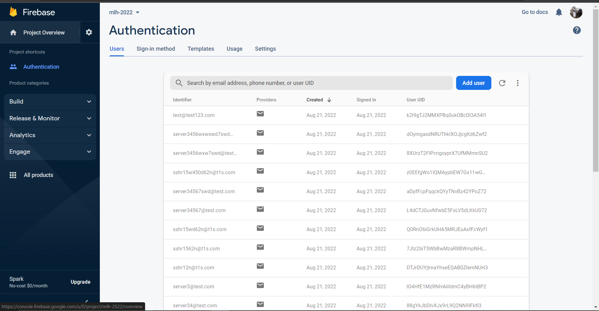
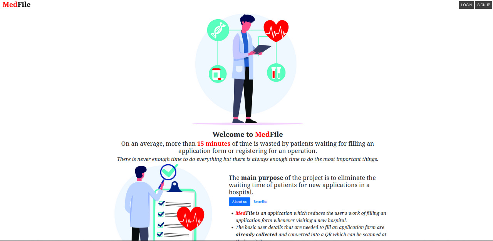
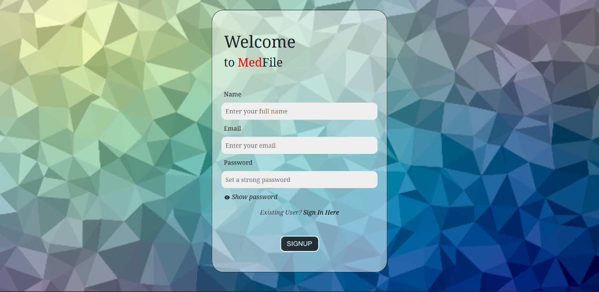

<h1 align="center">MedFile</h1>

<h2  align="center" id="description">MedFile is a web-application where patients can register themselves providing their basic details and generating a QR code for themselves which can be shown at any hospital for filling up the application forms for treatment,  thus, saving the waiting time for the patients.</h2>

<h2>Features</h2>

Here're some of the project's major features:

*   Add user accounts (SignUp/SignIn).
*   Update user details.
*   Add medical record details (Past Operations, Ongoing Ailments, Allergies).
*   Generate a QR code for the details entered.

<h2>Check it out at: https://medfile-hack-a-day-2.vercel.app/</h2>

<h2>Built with</h2>

**Front-End:** 
* React.Js

**Back-End**
* FireBase
* Node.Js

## Deployed to

- <h2>Front-end : Vercel </h2>

- <h2>Back-end : Heroku </h2>

<h2>Like our work?</h2>

Contact us at: ps2644@srmist.edu.in sshsrn@gmail.com 

## Screenshots

